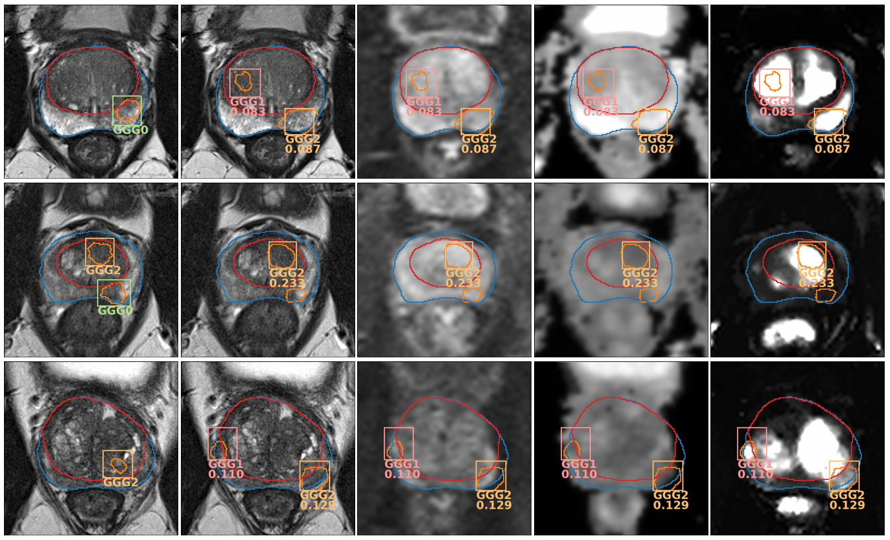

# Prostate mpMRI lesion detection system
This repository contains the code for the paper [Deep Learning system for fully automatic detection, segmentation and Gleason Grade estimation of prostate cancer in multiparametric Magnetic Resonance Images](TO DO), which proposes a fully automatic system that takes a prostate multi-parametric magnetic resonance images (mpMRIs) from a prostate cancer (PCa) suspect and, by leveraging the [Retina U-Net detection model](https://arxiv.org/abs/1811.08661), locates PCa lesions, segments them, and predicts their most likely Gleason grade group (GGG). 

This model has been adapated to only use [ProstateX data](https://wiki.cancerimagingarchive.net/display/Public/SPIE-AAPM-NCI+PROSTATEx+Challenges), achieving an AUC of 0.87 at the challenge online learderboard, hence tying up with the winner of the original [ProstateX challenge](https://doi.org/10.1117/1.jmi.5.4.044501).

Please, cite the paper if you use any of the code in this repository:
```
TO DO
```
This is an example of the output of the model:

<figcaption>Output of the model evaluated on three ProstateX test patients. First image from the left shows the GT on the T2 mpMRI sequence; the rest show the output predictions of the model on different sequences (from left to right: T2, b800, ADC, Ktrans). GGG0 (benign) detections are not shown and only the highest-scoring detection is shown for highly overlapped detections (IoU > 0.25). Detections with a confidence below the lesion-wise maximum sensitivity setting (t=0.028) are also ignored.</figcaption>

## Overview
This repository contains three main Jupyter Notebooks:
- [ProstateX preprocessing](ProstateX%20preprocessing.ipynb): Performs the preprocssing of the ProstateX data. All steps, from downloading the data to configuring the Notebook are explained within it. At the end, it creates a `ID_img.npy` file containng the processed image and masks, a `ID_rois.npy` file containing the lesions, and a `meta_info_ID.pickle` containing important meta information for every patient `ID`.
- [Registration example](Registration%20example.ipynb): Notebook for performing general medical image registration, but adapated to register prostate ADC maps to T2 sequences. It takes some unregistered `ID_img.npy` files and produces a SimpleITK transform for each of them as output as `ID.tfm`.
- [Result analysis](./MDT_ProstateX/Result%20analysis.ipynb): It analyzes the results produced by the Retina U-Net model (`processed_pred_boxes_overall_hold_out_list_test.pickle`), allowing to plot the ground truth alongside the predicted detections, obtain metrics and ROC curves at lesion and patient level, and generate a ProstateX challenge submission.

Additionally, the directory `./MDT_ProstateX` contains a complete fork of the [Medical Detection Toolkit](https://github.com/MIC-DKFZ/medicaldetectiontoolkit/tree/torch1x), which is employed as the backend for the system and has been modified to adapt it to this task. All modifications to any of the files have been listed in their headers, in compliance with the Apache 2.0 license used by that project.

## Installation
To install, please clone this repository and install required packages. It is recommended to use a package manager such as pip or conda. If not sure, you can download and install the [latest miniconda release](https://docs.conda.io/en/latest/miniconda.html) before continuing and install `git` from the conda console: `conda install git`

```bash
git clone https://github.com/OscarPellicer/prostate_lesion_detection.git

#You probably want to create an environment first. Using conda:
conda create -n prostate_lesion python=3.7
conda activate prostate_lesion

#Install required libraries. Using conda:
conda install matplotlib, numpy, ipywidgets, ipython, scipy, pandas==0.25.3, jupyter, ipython, scikit-learn
conda install simpleitk -c SimpleITK==1.2.4
conda install pydicom -c conda-forge
#pip install matplotlib, numpy, ipywidgets, ipython, scipy, simpleitk, pandas==0.25.3, pydicom, jupyter, ipython, scikit-learn
```

You will also need [`plot_lib`](https://github.com/OscarPellicer/plot_lib) for plotting the mpMRIs within the Jupyter Notebooks. To install it, you may simply clone the repository to your home path: 
```bash
git clone https://github.com/OscarPellicer/plot_lib.git
```

Then, some zip files will need to be unpacked, in particular:
- `ProstateX_masks.zip`: This contains **automatically generated** ProstateX masks for the whole prostate as well as the central zone, using the model from: [Robust Resolution-Enhanced Prostate Segmentation in Magnetic Resonance and Ultrasound Images through Convolutional Neural Networks](https://doi.org/10.3390/app11020844)
- `ProstateX_transforms.zip`: This contains the transforms for registration of the ProstateX dataset. These were generated using the Notebook [Registration example](Registration%20example.ipynb) from this repository.
- `./MDT_ProstateX/experiments/exp0/test/test_boxes.zip`: This is the output of the model for the test set, which can be analyzed using the Notebook [Result analysis](./MDT_ProstateX/Result%20analysis.ipynb) from this repository.
- `./MDT_ProstateX/experiments/exp0/test/train_boxes.zip`: This is the output of the model for the test set, which can be used to compete in the ProstateX online challenge using the Notebook [Result analysis](./MDT_ProstateX/Result%20analysis.ipynb) from this repository.

All these can be manually unziped, or using the following commands
```bash
unzip *.zip -d ./
unzip ./MDT_ProstateX/experiments/exp0/test/*.zip -d ./MDT_ProstateX/experiments/exp0/test/
```

Up to this point, you will be able to run any of the provided Jupyter Notebooks, but you will not be able to use the [Medical Detection Toolkit](https://github.com/MIC-DKFZ/medicaldetectiontoolkit/tree/torch1x) for training or inference, as you still need to install the packages required by it as well. To do so, it might worth looking at the documentation of the original toolkit at [Readme](./MDT_ProstateX/Readme.md). In summary, you will need to do two things:

First, you need to go to https://developer.nvidia.com/cuda-gpus, look at the Compute Capability of your Nvidia GPU, and create an environmental variable with the version, such as: 
```bash
export TORCH_CUDA_ARCH_LIST="6.1;7.5"
```

Then, using the same shell, got to the `MDT_ProstateX` folder, and run the setup script to install the required libraries:
```bash
cd MDT_ProstateX
python setup.py install
```

## Usage
All the provided Jupyter Notebooks can be run wihtout actually using the Deep Learning model.

To use the provided model for inference on new data, you will have to first preprocess your images identicaly to how the ProstateX images have been processed using [ProstateX preprocessing](ProstateX%20preprocessing.ipynb). Then, replace the IDs in the `test` key of the `ss_v2` dictionary at the beginning of the file `./MDT_ProstateX/experiments/exp0/data_loader.py` for your own IDs. Finally, run the model in inference mode and aggragate the results:

```bash
%run exec.py --mode train_test --exp_source experiments/exp0 --exp_dir experiments/exp0
%run exec.py --mode analysis --exp_source experiments/exp0 --exp_dir experiments/exp0
```

To use the [Medical Detection Toolkit](https://github.com/MIC-DKFZ/medicaldetectiontoolkit/tree/torch1x) for training, please create a directory within the `MDT_ProstateX/experiments` directory containing a copy of the files: `configs.py`, `custom_transform.py`, and `data_loader.py`. These files will have to be modified to fit your needs, or, at the very least, the dictionary `ss_v2` dictionary at the beginning of the file `data_loader.py` should be modified to include your own IDs.